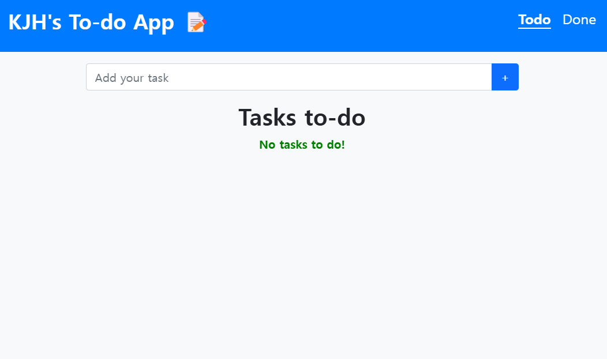
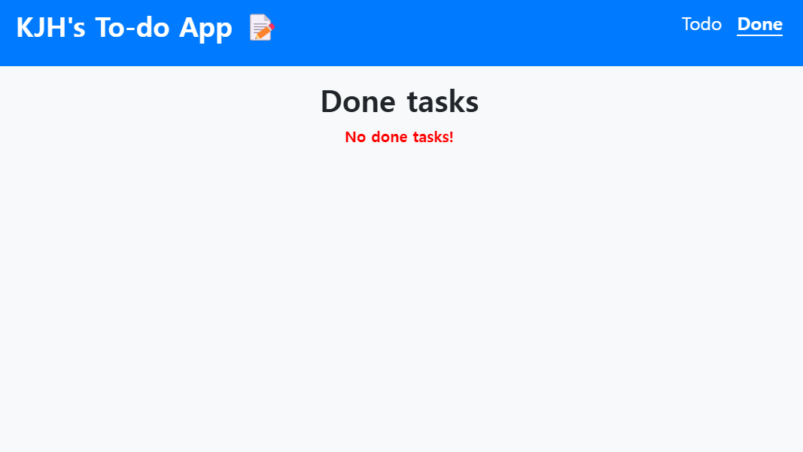
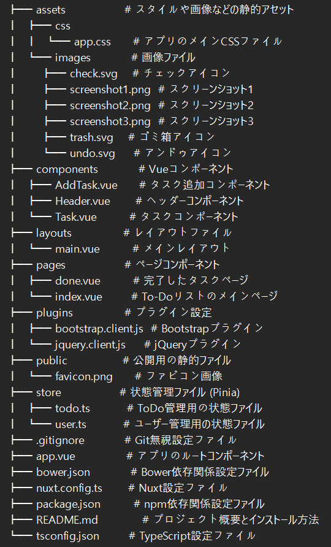

<div align="center">
<h2>[2024] Nuxt3を用いたTODO管理アプリ</h2>
日々のタスクを管理し、簡単なドラッグ＆ドロップで整理できるシンプルなToDoアプリです。
</div>

## 目次
- [概要](#概要)
  - [プロジェクト説明](#プロジェクト説明)
  - [スクリーンショット](#スクリーンショット)
- [使用技術](#使用技術)
- [インストール方法](#インストール方法)
  - [前提条件](#前提条件)
  - [インストール手順](#インストール手順)
  - [プロジェクト実行](#プロジェクト実行)
- [機能の使い方](#機能の使い方)
- [ディレクトリ構成](#ディレクトリ構成)

---

## 概要

### プロジェクト説明
このプロジェクトは、Nuxt3、Vue、TypeScriptを使用して開発されたタスク管理アプリです。タスクの追加、削除、ドラッグ＆ドロップによる並び替えが可能で、BowerとjQueryを使用してドラッグ機能を実装しています。また、Piniaで状態管理を行い、簡単で直感的なインターフェースを提供しています。

### スクリーンショット

|||
|:---:|:---:|
|タスク管理画面|完了済みタスク画面|

## 使用技術

- HTML5
- CSS3
- jQuery
- TypeScript
- Vue.js
- Nuxt.js 3
- Pinia (状態管理)
- Bower (依存管理)

---

## インストール方法

### 前提条件

このプロジェクトを実行するには、以下のソフトウェアが必要です:
- **Node.js** (v14以降): [Download](https://nodejs.org/)
- **npm** または **yarn**
- **Bower**（依存関係の管理用）を以下のコマンドでインストールしてください:

  ```bash
  npm install -g bower

### インストール手順

- このリポジトリをクローンします:

  ```bash
  git clone https://github.com/yourusername/Jaehyung-Nuxt3-Todo.git
  cd Jaehyung-Nuxt3-Todo

- npmとBowerを使用して依存関係をインストールします:

  ```bash
  npm install
  bower install

### プロジェクト実行

- 開発用サーバーを開始するには以下のコマンドを使用します:

  ```bash
  npm run dev
  
アプリケーションは http://localhost:3000 でアクセス可能です。

## 機能の使い方

1. タスク管理: タスクの追加、削除、並び替えが可能です。jQueryのdraggableおよびsortable機能を使用して、ドラッグ＆ドロップで簡単に整理できます。
2. レスポンシブUI: Vue.jsとCSSを使用し、快適に操作できるインターフェースを実現しています。（優先度が設定されており、作成時間も表示されています）
3. 状態管理: Piniaを使用してアプリケーションの状態を効率的に管理しています。

## ディレクトリ構成

||
|:---:|
|ディレクトリ構成|

